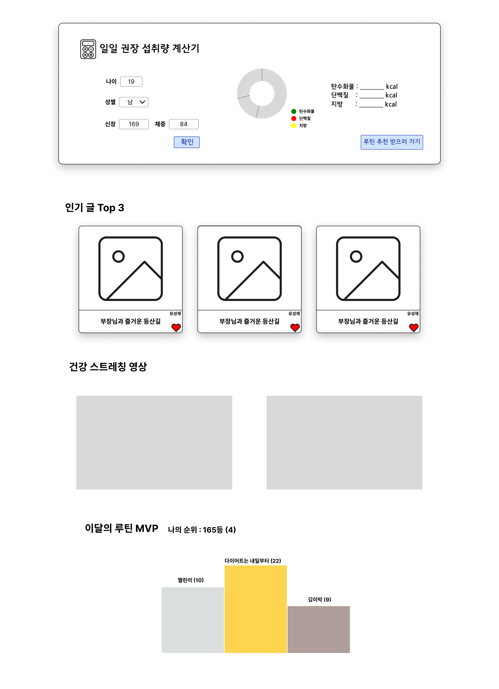
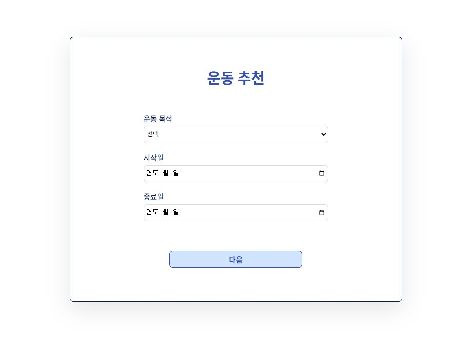
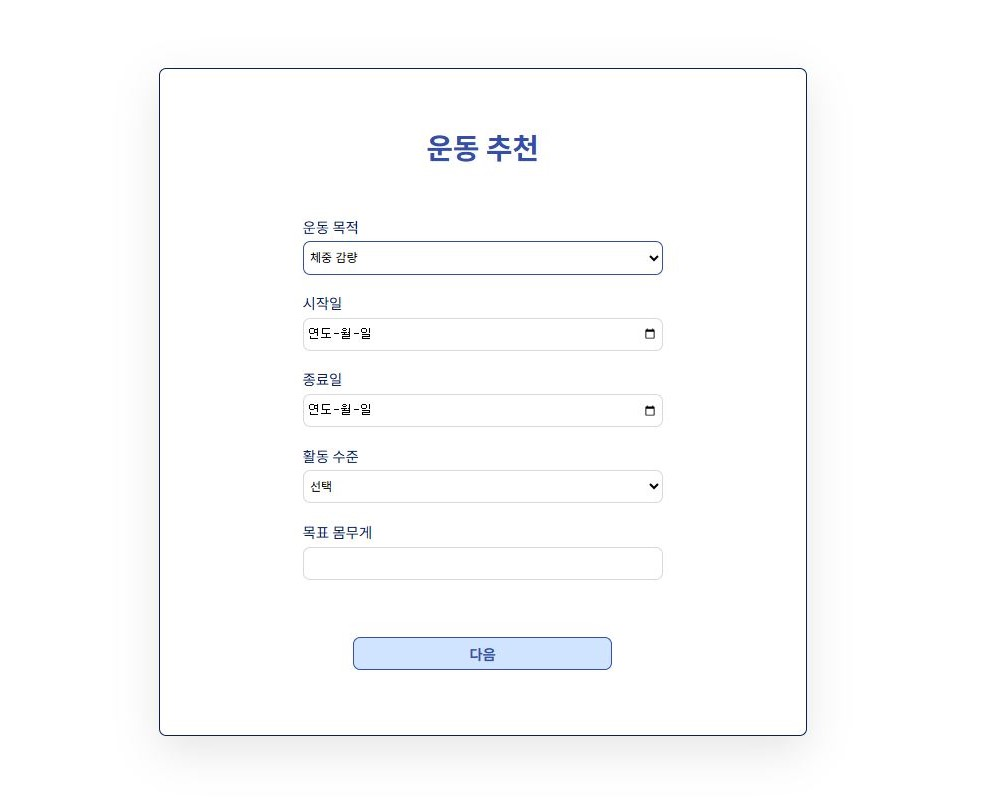
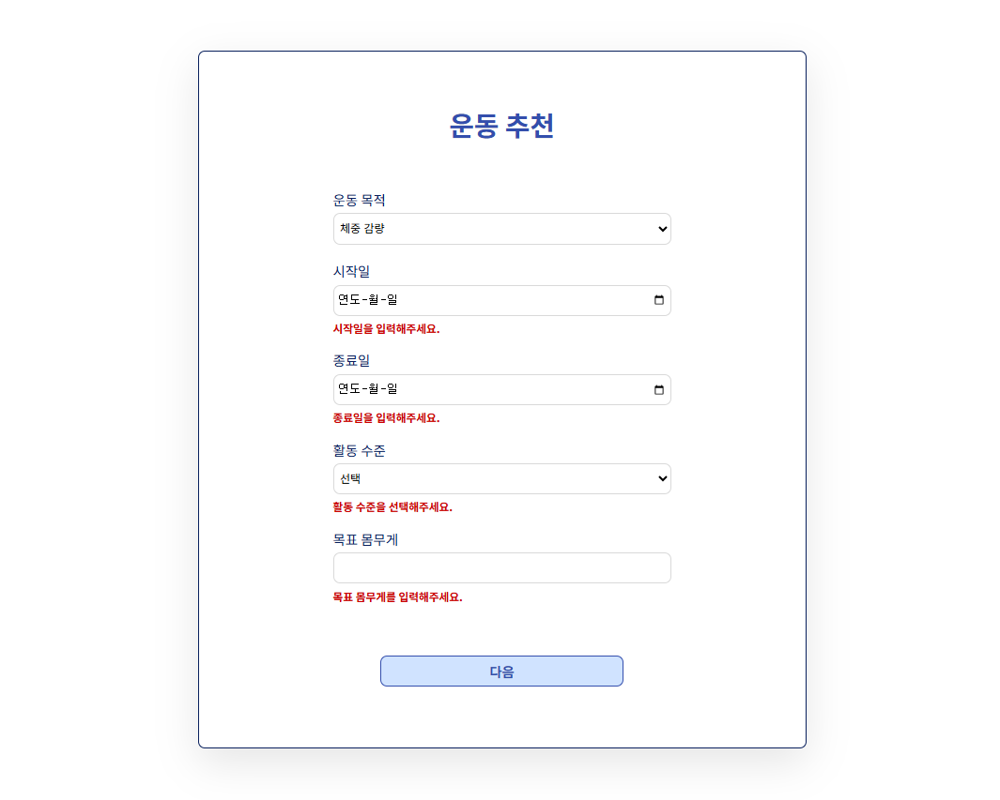
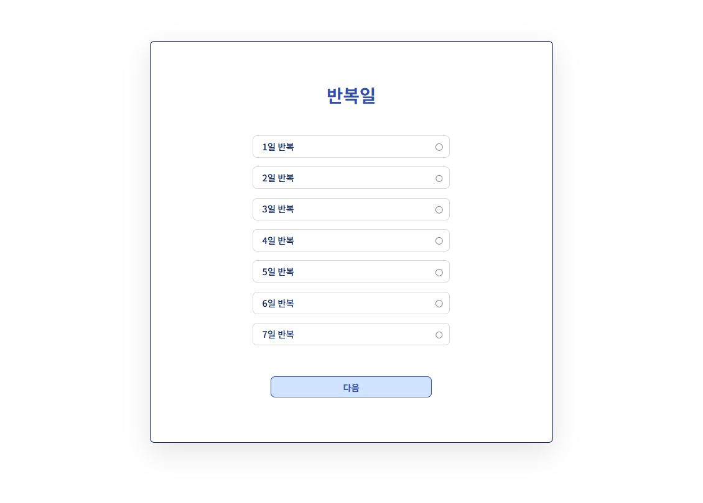
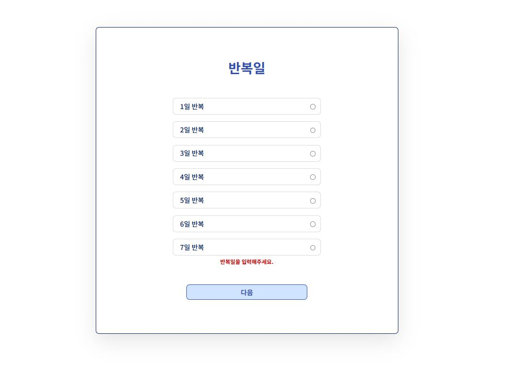
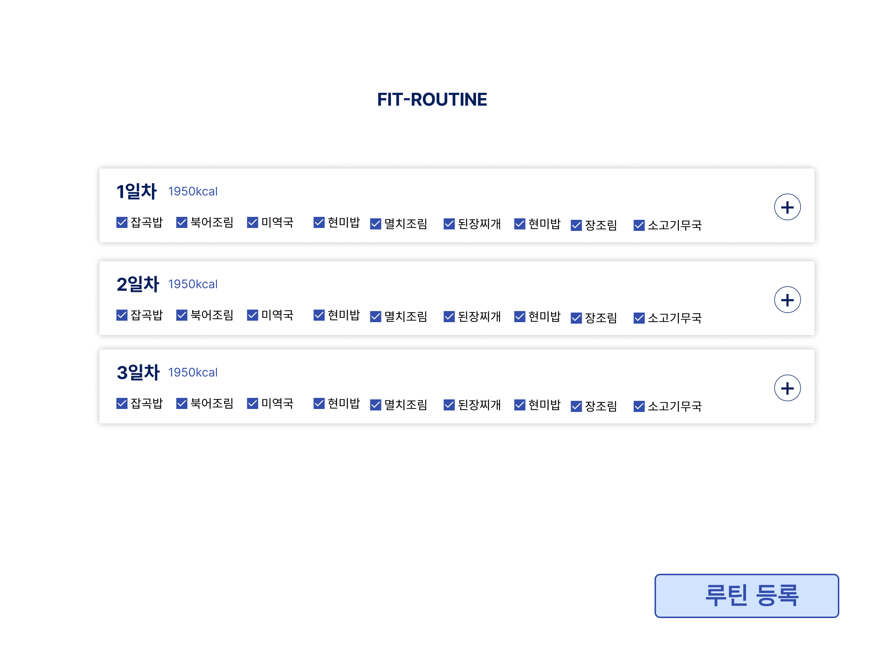
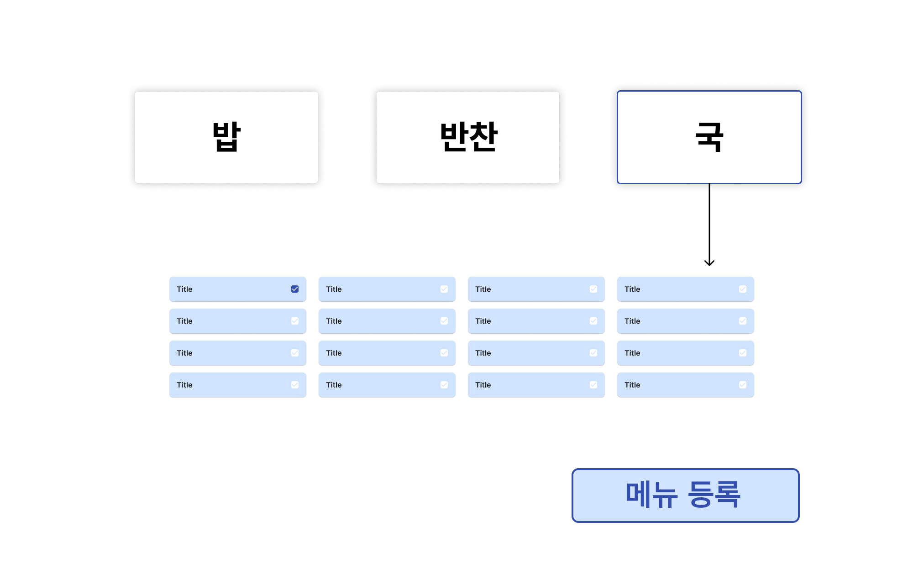

# 💻 화면 설계서

> ## 메인페이지

### 화면 개요

| 화면 ID | 화면명 | 화면 설명 |
| --- | --- | --- |
| Main-Page | 메인 페이지 | 사용자에 따른 권장 섭취량 계산과 커뮤니티 인기글 등을 확인할 수 있는 화면 |

### 화면 이미지

### UI 구성 요소

| 요소명 | 설명 |
| --- | --- |
| 일일 권장 섭취량 계산기 | 사용자가 나이 및 본인의 신체 정보를 입력하면 본인에게 권장되는 하루 권장 섭취량을 계산하여 보여주는 기능 |
| 인기글 Top 3 | 블로그 게시판 중 좋아요 순이 높은 3개의 게시물을 보여준다. |
| 건강 스트레칭 영상 | 스트레칭 관련 영상을 두가지 게시하여 사용자에게 제공한다. |
| 루틴 MVP | 블로그 게시판 중 작성글이 가장 많은 회원 3명을 선정하여 보여주며, 사용자의 순위도 확인 가능하다. |

  

> ## 회원 - 회원가입

### 화면 개요

| 화면 ID | 화면명 | 화면 설명 |
| --- | --- | --- |
| SignUP-01 | 회원 가입 페이지 | 사용자가 이메일, 비밀번호, 휴대폰 번호를 입력하여 계정을 생성하는 화면 |

### 화면 이미지

.JPG)

### UI 구성 요소

| 요소명 | 설명 | 유효성 |
| --- | --- | --- |
| 이메일 | 사용자의 이메일 주소를 입력 | 이메일 형식으로 입력하며, 중복되지 않아야 한다. |
| 비밀번호 | 사용자의 비밀번호를 입력 | 하나 이상의 영문자, 숫자를 포함해야 한다. |
| 전화번호 | 사용자의 전화번호를 입력 | 앞자리는 010~019 사이의 숫자를 선택하며, 중복되지 않아야 한다. |
| 닉네임 | 사용자의 닉네임을 입력 | 영문 소문자, 숫자, 한글로 이루어진 2~16자의 문자열이어야 한다. |
| 생년월일 | 사용자의 생년월일을 입력 |  | 
| 성별 | 사용자의 성별을 입력 | 남성, 여성 중 하나의 성별을 선택해야 한다. | 
| 신장 | 사용자의 신장을 입력 | 숫자 형태여야 하며 0~500 사이의 값이어야 한다. | 
| 체중 | 사용자의 체중을 입력 | 숫자 형태여야 하며 0~500 사이의 값이어야 한다. | 
| 다음 버튼 | 입력값이 모두 유효하면 다음 페이지로 이동 | 입력값들의 유효성을 검사한 후 로그인 페이지로 이동한다. |

### 유효성 검사 및 오류 메시지

.JPG)
유효하지 않은 값을 입력했을 경우 입력 요소 아래에 즉각적으로 에러 메시지를 표시해준다.

  

> ## 회원 - 로그인

### 화면 개요

| 화면 ID | 화면명 | 화면 설명 |
| --- | --- | --- |
| Login-01 | 로그인 페이지 | 사용자가 이메일, 비밀번호를 입력하여 로그인하는 화면 |

### 화면 이미지

.JPG)

### UI 구성 요소

| 요소명 | 설명 | 유효성 |
| --- | --- | --- |
| 이메일 | 이메일을 입력 | 회원가입 시 등록한 이메일을 입력한다. |
| 비밀번호 | 비밀번호를 입력 | 회원가입 시 등록한 비밀번호를 입력한다. |
| 로그인 버튼 | 로그인을 진행한다. | 입력값들의 유효성을 검사한 후 메인 페이지로 이동한다.  |

### 유효성 검사 및 오류 메시지

.JPG)
유효하지 않은 값을 입력했을 경우 입력 요소 아래에 즉각적으로 에러 메시지를 표시해준다.

  

> ## 회원 - 마이페이지(프로필)

### 화면 개요

| 화면 ID | 화면명 | 화면 설명 |
| --- | --- | --- |
| MyPage-01 | 내 프로필 페이지 | 로그인한 사용자의 정보를 확인할 수 있는 페이지 |

### 화면 이미지

.png>)

### UI 구성 요소

| 요소명 | 설명 | 
| --- | --- | 
| 회원 정보 | 로그인한 사용자의 정보를 확인할 수 있다. |
| 관심 목록 | 관심 등록한 사용자 목록을 확인할 수 있다. | 
| 수정 버튼 | 로그인한 사용자의 정보를 수정할 수 있다. |
| 탈퇴 버튼 | 회원 탈퇴를 진행할 수 있다. | 

  

> ## 회원 - 마이페이지(정보 수정)

### 화면 개요

| 화면 ID   | 화면명           | 화면 설명                         |
| --------- | ---------------- | --------------------------------- |
| MyPage-02 | 정보 수정 페이지 | 회원 정보를 수정할 수 있는 페이지 |

### 화면 이미지

.JPG)

### UI 구성 요소

| 요소명 | 설명 | 유효성 |
| --- | --- | --- |
| 닉네임 | 사용자의 닉네임을 수정 | 영문 소문자, 숫자, 한글로 이루어진 2~16자의 문자열이어야 한다. |
| 기존 비밀번호    | 기존 비밀번호를 입력 | 기존 비밀번호와 일치해야 새 비밀번호를 입력할 수 있다. |
| 새 비밀번호/확인 | 새 비밀번호를 입력하고 확인 | 하나 이상의 영문자, 숫자를 포함해야 한다. |
| 휴대폰 | 연락처를 수정 | 앞자리는 010~019 사이의 숫자를 선택하며, 수정할 연락처는 등록되지 않은 연락처여야 한다. |
| 체중/신장 | 사용자의 체중/신장을 수정 | 숫자 형태여야 하며 0~500 사이의 값이어야 한다. |
| 수정 버튼 | 사용자가 입력한 정보로 수정 | 수정이 정상적으로 완료되면 내 프로필 페이지로 이동한다. |
| 취소 버튼 | 정보를 수정하지 않음 | 정보 수정  없이 내 프로필 페이지로 이동한다. |

### 유효성 검사 및 오류 메시지

.JPG)
유효성 검사를 통해 입력 요소 아래 에러 메시지를 표시해준다.

  

> ## 회원 - 마이페이지(관심 목록)

### 화면 개요

| 화면 ID | 화면명 | 화면 설명 |
| --- | --- | --- |
| MyPage-03 | 관심 목록 페이지 | 관심 블로그 목록을 볼 수 있는 페이지 |

### 화면 이미지

.png>)

### UI 구성 요소

| 요소명 | 설명 |
| --- | --- |
| 회원 프로필    | 관심 등록한 회원을 표시, 클릭하면 해당 회원의 블로그로 이동한다. |
| 관심 끊기 버튼 | 버튼을 클릭하며 해당 블로그를 관심 목록에서 제거한다.            |

  

> ## 회원 - 회원 탈퇴

### 화면 개요

| 화면 ID | 화면명 | 화면 설명 |
| --- | --- | --- |
| ReSign-01 | 회원 탈퇴 페이지 | 회원 탈퇴를 진행하는 페이지 |

### 화면 이미지
.png)
.png>)

### UI 구성 요소

| 요소명 | 설명 | 유효성 |
| --- | --- | --- |
| 비밀번호 | 로그인 사용자의 비밀번호를 확인 | 해당 회원의 비밀번호와 일치하는지 확인한다. |

### UI 구성 요소

| 요소명 | 설명 |
| --- | --- |
| 아이디 | 탈퇴하려는 회원의 아이디를 확인할 수 있다.   |
| 닉네임 | 탈퇴하려는 회원의 닉네임을 확인할 수 있다.   |
| 체크리스트 | 탈퇴 사유를 체크리스트에서 선택할 수 있다. |
| 사유 입력 폼 | 탈퇴 사유를 직접 작성할 수 있다. |
| 탈퇴 확인 버튼 | 최종적으로 탈퇴를 진행한다. |
| 탈퇴 취소 버튼 | 탈퇴를 취소하고 내 프로필 페이지로 이동한다. |

  

## 추천 페이지
> ## 목적 설정

### 화면 개요

| 화면 ID | 화면명 | 화면 설명 |
| --- | --- | --- |
| EXE-01, FOOD-01 | 운동 목적 설정페이지 | 사용자가 운동 목적을 설정하는 페이지 |

### 화면 이미지

### UI 구성 요소

| 요소명 | 설명 | 유효성 |
| --- | --- | --- |
| 운동 목적 | 사용자가 원하는 운동 목적을 설정 | 네가지 중 한가지를 선택할 수 있다. |
| 시작일 | 사용자가 운동/식단 시작하는 날을 설정할 수 있다. | 기본 금일이며, 사용자가 수정할 수 있다. |
| 종료일 | 사용자가 운동/식단 종료하고자 하는 날을 설정할 수 있다. | 종료일은 시작일보다 작을 수 없다. |
| 다음 버튼 | 다음 페이지로 이동하는 버튼 | 모든 요소를 입력해야 버튼이 활성화 된다. |

  

> ## 목표 설정

### 화면 개요

| 화면 ID | 화면명 | 화면 설명 |
| --- | --- | --- |
| EXE-01, FOOD-01 | 운동 목표 설정 페이지 | 목적이 체중감량인 사용자에 한하여 목표 몸무게를 설정하는 화면 |

### 화면 이미지

### UI 구성 요소

| 요소명 | 설명 | 유효성 |
| --- | --- | --- |
| 활동 수준 | 사용자의 평소 활동 수준을 선택 | 네가지 활동 수준 중 하나를 선택해야 한다. |
| 목표 몸무게 | 감량하고자 하는 목표 몸무게를 설정한다. | 현재 몸무게 이상으로는 설정할 수 없다. |
| 다음 버튼 | 다음 페이지로 이동하는 버튼 | 모든 요소 입력 후 이동 가능하다. |

### 유효성 검사 및 오류 메시지

유효성 검사를 통해 입력 요소 아래 에러 메시지를 표시해준다.

  

> ## 반복일 설정

### 화면 개요

| 화면 ID | 화면명 | 화면 설명 |
| --- | --- | --- |
| EXE-02, FOOD-02 | 운동/식단 반복일 설정 페이지 | 사용자가 운동/식단 반복일을 선택하는 화면 |

### 화면 이미지

### UI 구성 요소

| 요소명 | 설명 |
| --- | --- |
| 반복일 | 최소 하루부터 최대 7일까지 반복일을 설정할 수 있다. |
| 다음 버튼 | 반복일 선택 후 다음 페이지로 이동한다. |

### 유효성 검사 및 오류 메시지

유효성 검사를 통해 입력 요소 아래 에러 메시지를 표시해준다.

> ## 운동 - 루틴 추천

### 화면 개요

| 화면 ID | 화면명 | 화면 설명 |
| --- | --- | --- |
| EXE-03  | 루틴 추천 페이지 | 반복일에 따른 루틴을 추천해주는 화면 |

### 화면 이미지

### UI 구성 요소

| 요소명 | 설명 |
| --- | --- |
| n일차 루틴 | 사용자가 설정한 반복일에 따라 일차 수마다 루틴을 랜덤으로 제공해준다. |
| + 버튼 | 사용자가 직접 운동을 추가할 수 있다. |
| 루틴 등록 버튼 | 루틴 등록 후에 투두리스트 페이지로 이동한다. |

  

### 화면 개요

| 화면 ID | 화면명 | 화면 설명 |
| --- | --- | --- |
| EXE-03  | 루틴 추천 페이지 | 사용자가 원하는 운동을 선택하는 화면 |

### 화면 이미지

.png)

### UI 구성 요소

| 요소명 | 설명 |
| --- | --- |
| 카테고리 | 상체, 하체, 유산소, 생활운동 네가지 카테고리 중 선택 가능하다. |

### 유효성 검사 및 오류 메시지

운동 목적에 따른 유효성 검사

- 운동 목적이 체중감량인 사용자
  .png>)
  목적이 체중감량인 사용자가 추천 루틴을 해제하여 목표 소모 칼로리에 미달될 경우 메시지를 표시해 준다.

> ## 식단 - 식단 추천
### 화면 개요

| 화면 ID | 화면명 | 화면 설명 |
| --- | --- | --- |
| FOOD-03 | 식단 추천 페이지 | 사용자에게 식단을 추천하는 화면 |

### 화면 이미지

### UI 구성 요소

| 요소명 | 설명 |
| --- | --- |
| n일차 루틴 | 사용자가 설정한 반복일에 따라 일차 수마다 식단을 랜덤으로 제공해준다. |
| + 버튼 | 사용자가 직접 메뉴를 수정할 수 있다. |
| 루틴 등록 버튼 | 루틴 등록 후에 투두리스트 페이지로 이동한다. |

  

### 화면 개요

| 화면 ID | 화면명 | 화면 설명 |
| --- | --- | --- |
| FOOD-03 | 식단 추천 페이지 | 사용자가 원하는 식단을 수정하는 페이지 |

### 화면 이미지

### UI 구성 요소

| 요소명 | 설명 |
| --- | --- |
| 식단 추천 결과 | n일차에 해당하는 식단을 수정할 수 있다. |

  

### 화면 개요

| 화면 ID | 화면명 | 화면 설명 |
| --- | --- | --- |
| FOOD-03  | 식단 추천 페이지 | 사용자가 원하는 식단을 선택하는 화면 |

### 화면 이미지

### UI 구성 요소

| 요소명 | 설명 |
| --- | --- |
| 카테고리 | 밥, 국, 반찬 세가지 카테고리 중 선택 가능하다. |

  

> ## 블로그 - 개인 블로그

### 화면 개요

| 화면 ID | 화면명 | 화면 설명 |
| --- | --- | --- |
| Blog-a  | 개인 블로그 페이지 | 한 회원의 블로그 페이지 |

### 화면 이미지

.png>)

### UI 구성 요소

| 요소명 | 설명 | 유효성 |
| --- | --- | --- |
| 관심 블로그 등록 | 관심버튼을 클릭해 나의 관심목록에 추가 | 블로그 페이지 유저와 로그인 유저가 같다면 버튼은 비활성화 된다. |
| 블로그 게시물 | 블로그 유저가 올렸던 게시물들이 표시된다. | |
| 페이징 바 | 한 페이지당 6개의 게시물이 보여진다. | |
| 소개글 | 블로그 유저의 소개글을 설정 | 블로그 유저와 로그인 유저의 정보가 같을 때 버튼이 표시된다. 80자 제한으로 작성 가능하다. |

  

> ## 블로그 - TODO LIST

### 화면 개요

| 화면 ID | 화면명 | 화면 설명 |
| --- | --- | --- |
| Blog-b  | TODO LIST 화면 | 사용자의 TODO LIST를 확인하고 게시글을 등록할 수 있는 화면 |

### 화면 이미지

.png>)

### UI 구성 요소

| 요소명 | 설명 |
| --- | --- |
| 캘린더 | 해당 월의 달력이 표시된다. 게시물 개수에 따라 통계를 내어 색상이 다르게 표시된다. |
| 게시물 등록 | 날짜마다 존재하는 + 버튼을 통해 게시물을 등록할 수 있다. |
| 게시물 표시 | 게시물이 등록된 날짜에 게시물 제목이 표시된다. 클릭 시 게시물 상세 페이지로 이동한다. |
| TODO LIST | 사용자가 등록한 운동/식단 리스트를 표시해준다. |
| 수정, 삭제 버튼 | 해당 기간 내 운동/식단 투두리스트 수정 페이지로 이동한다. | 

  

> ## 블로그 - 게시판

### 화면 개요

| 화면 ID | 화면명 | 화면 설명 |
| --- | --- | ---- |
| Blog-f  | 게시판 페이지 | 게시판 목록이 표시되는 화면 |

### 화면 이미지

.png>)

### UI 구성 요소

| 요소명 | 설명 |
| --- | --- |
| 카테고리    | 표시할 게시물의 카테고리를 설정한다. |
| 게시물 순서 | 표시할 게시물의 순서를 설정한다. |

---

### 화면 개요

| 화면 ID | 화면명             | 화면 설명                               |
| ------- | ------------------ | --------------------------------------- |
| Blog-e  | 게시물 상세 페이지 | 특정 게시물의 상세 항목을 표시하는 화면 |

### 화면 이미지

.png>)

### UI 구성 요소

| 요소명         | 설명                                                                         |
| -------------- | ---------------------------------------------------------------------------- |
| 작성자 프로필  | 게시물, 댓글 작성자의 프로필을 표시한다. 클릭 시 작성자의 블로그로 이동한다. |
| 스크롤 버튼    | 게시물의 최상단, 최하단으로 이동할 수 있는 버튼                              |
| 게시물 이미지  | 최대 8개까지 표시된다.                                                       |
| 게시물 내용    | 게시물 등록 유저가 작성한 글 내용이 표시된다.                                |
| 수정/삭제 버튼 | 게시물 작성자와 로그인 유저의 정보가 동일한 경우 표시된다.                   |
| 좋아요 버튼    | 해당 게시물, 댓글에 공감할 수 있는 기능이다.                                 |
| 댓글           | 게시물에 대한 내용을 작성하며 최대 500자까지 작성 가능하다.                  |
| 대댓글         | 댓글에 대한 답변을 작성하며 최대 500자까지 작성 가능하다.                    |

---

### 화면 개요

| 화면 ID | 화면명             | 화면 설명                             |
| ------- | ------------------ | ------------------------------------- |
| Blog-c  | 게시물 등록 페이지 | 사용자가 게시물을 등록할 수 있는 화면 |

### 화면 이미지

.png>)

### UI 구성 요소

| 요소명    | 설명                        | 유효성                                                           |
| --------- | --------------------------- | ---------------------------------------------------------------- |
| 제목      | 게시물의 제목을 입력        | 최대 30자까지 입력 가능하다.                                     |
| 첨부파일  | 게시물에 대한 첨부파일 등록 | 최대 8개까지 JPG,PNG 확장자를 가진 이미지 파일을 등록할 수 있다. |
| 내용      | 게시물의 내용을 입력        | 최대 500자까지 입력 가능하다.                                    |
| 카테고리  | 게시물의 카테고리 설정      | 4가지 카테고리 중 선택 가능하며, 기본값은 '자유' 카테고리다.     |
| 등록 버튼 | 게시물을 등록하는 버튼      | 제목, 사진이 등록되어야 활성화된다.                              |

---

### 화면 개요

| 화면 ID | 화면명             | 화면 설명                    |
| ------- | ------------------ | ---------------------------- |
| Blog-d  | 게시물 수정 페이지 | 게시물을 수정할 수 있는 화면 |

### 화면 이미지

.png>)

### UI 구성 요소

| 요소명    | 설명                                   | 유효성                                                              |
| --------- | -------------------------------------- | ------------------------------------------------------------------- |
| 제목      | 기존 게시물의 제목이 입력되어있다.     | 최대 30자까지 입력 가능하다.                                        |
| 첨부파일  | 기존에 등록한 첨부파일이 존재          | 최대 8개까지 JPG,PNG 확장자를 가진 이미지 파일을 등록할 수 있다.    |
| 내용      | 기존 게시물의 내용이 입력되어있다.     | 최대 500자까지 입력 가능하다.                                       |
| 카테고리  | 기존 게시물의 카테고리로 선택되어있다. | 선택하지 않으면 기존 게시물 카테고리를 따른다.                      |
| 수정 버튼 | 게시물을 수정한다.                     | 정상적으로 수정이 이루어질 시 해당 게시물의 상세 페이지로 이동한다. |
